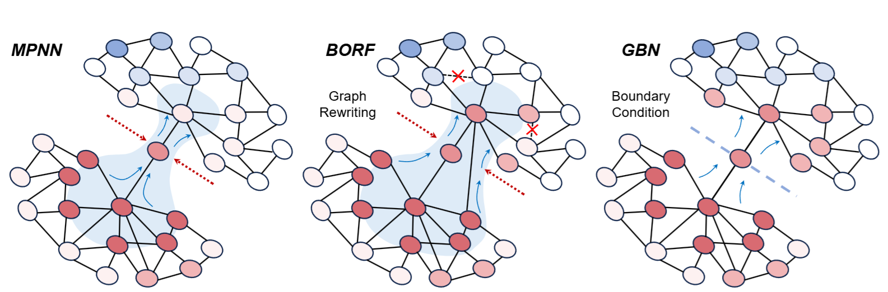
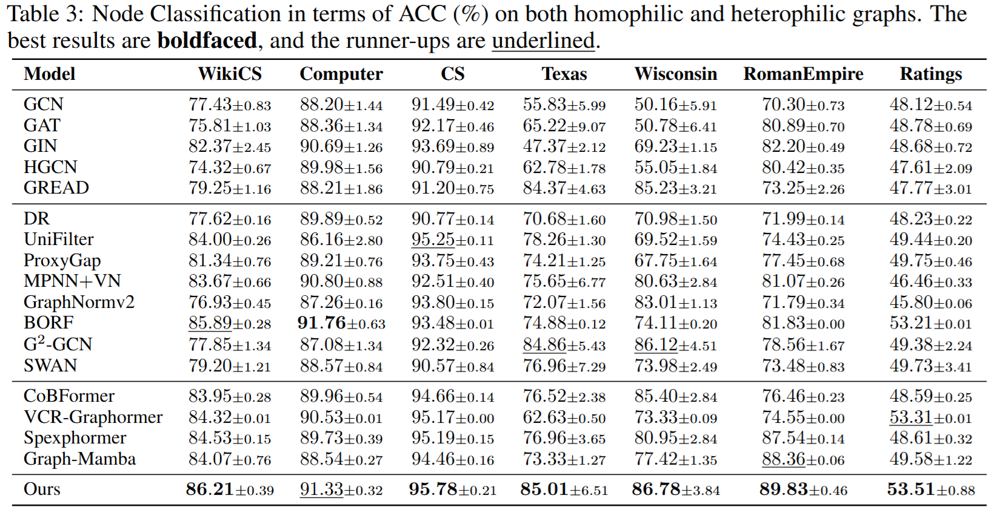
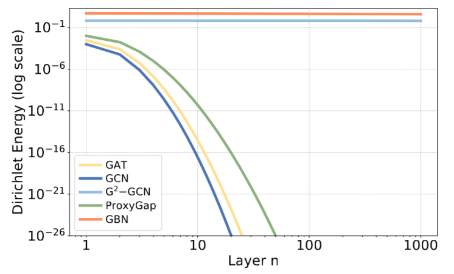
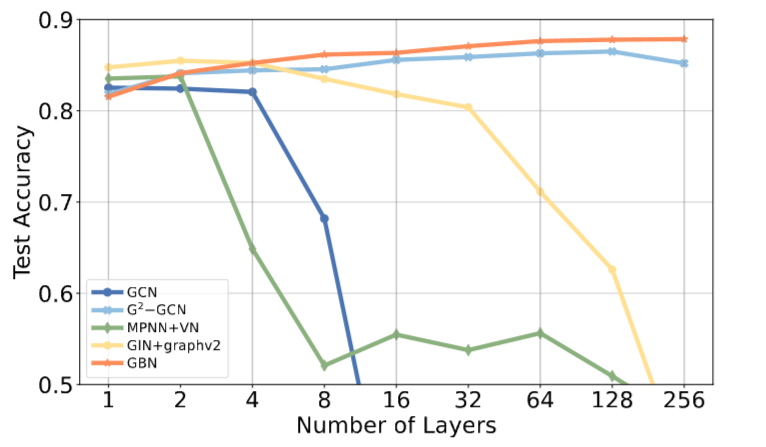
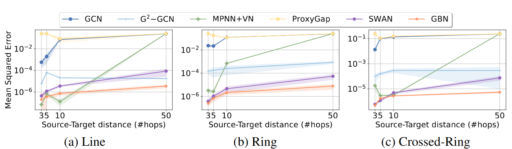
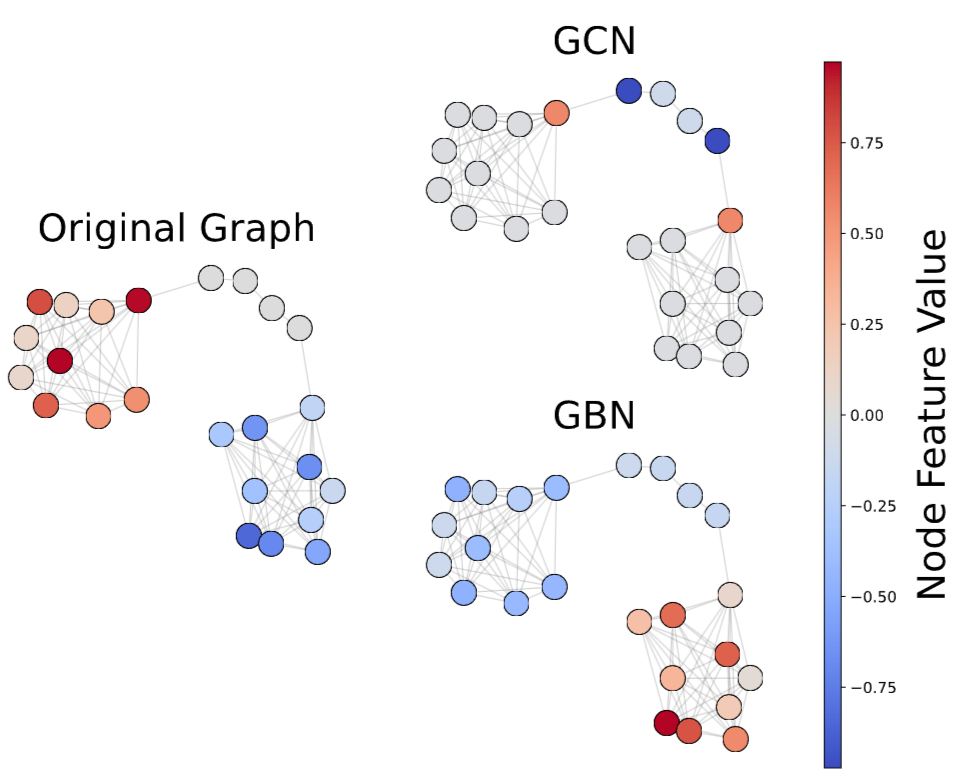

# GBN: Graph Boundary conditioned message passing Neural network

## Get start


Run the command
```shell
python main.py --task "${TASK}" --dataset "${DATA_NAME}"
```
Please replace ```${TASK}``` by ```NC``` or ```Transfer```, 
replace ```${DATA_NAME}``` by dataset name, e.g., ```CS```.

## Model Illustration

<div align=center>

</div>
<div align=center>
Figure 1. An Illustration of GBN
</div>

## Experimental Results
<div align=center>

</div>
<div align=center>
Figure 2. Node Classification Results
</div>

<div align=center>

</div>
<div align=center>
Figure 3. Dirichlet energy curve
</div>

<div align=center>

</div>
<div align=center>
Figure 4. Node classification accuracy with
respect to the number of network layers on
Cora dataset
</div>

<div align=center>

</div>
<div align=center>
Figure 5. Results of graph transfer task in terms of Mean Squared Error (%)
</div>

## Case Study
<div align=center>

</div>
<div align=center>
Figure 6. Case Study
</div>

## Citation
```text
@inproceedings{
sun2025deeper,
title={Deeper and Better: Mitigating Oversmoothing and Oversquashing in {MPNN}s via Local Riemannian Geometry},
author={Li Sun, Zhenhao Huang, Ming Zhang, Philip S. Yu},
booktitle={The Thirty-ninth Annual Conference on Neural Information Processing Systems},
year={2025},
url={https://openreview.net/forum?id=yNej0aGtAZ}
}
```